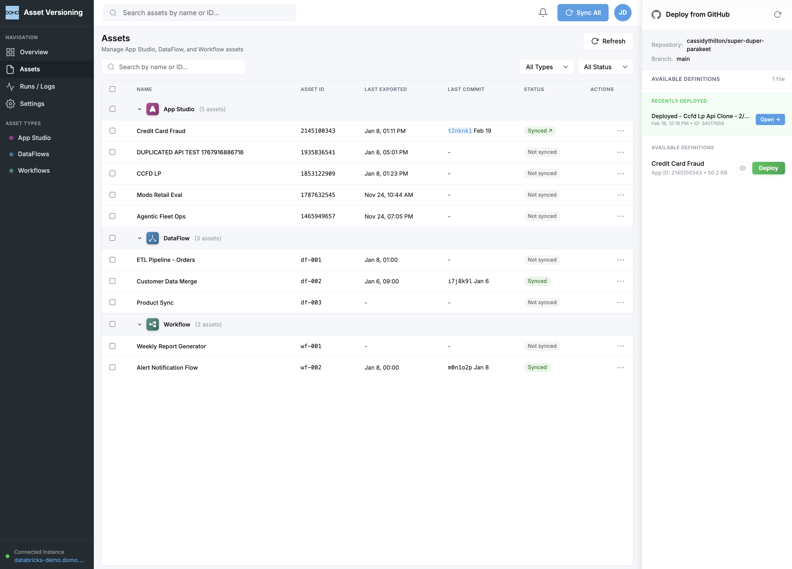
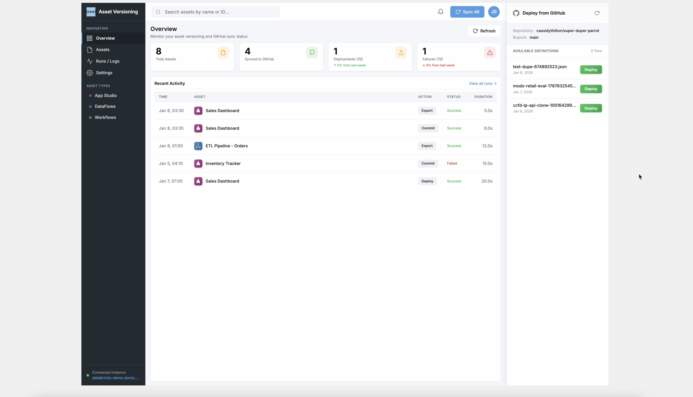

# Asset Versioning for Domo

> **A full-stack Domo custom app for version-controlling App Studio assets with GitHub integration — export definitions, commit to repos, deploy from version history, and track the full lifecycle of every asset across your Domo instance.**


---

## Screenshots

### Assets View
*Manage App Studio, DataFlow, and Workflow assets — export definitions, commit to GitHub, view details, and track sync status across your entire Domo instance.*



### Overview Dashboard
*Real-time statistics, recent activity feed, and the Deploy from GitHub sidebar — all in a single unified view.*



---

## What This App Does

Asset Versioning solves a critical gap in the Domo ecosystem: **there is no built-in way to version-control App Studio applications.** This app provides a complete Git-based versioning workflow directly inside Domo:

1. **Export** — Pull the live definition of any App Studio app via Domo's internal APIs
2. **Commit** — Push that definition as a JSON file to a GitHub repository
3. **Deploy** — Duplicate an app from a previously committed definition stored in GitHub
4. **Track** — Monitor sync status, commit history, and deployment logs

The result is a portable, auditable, Git-backed version history for every app in your Domo instance.

---

## Architecture

```
┌─────────────────────────────────────────────────────────────┐
│                    Domo Custom App (iframe)                  │
│  ┌──────────┐  ┌──────────┐  ┌──────────┐  ┌─────────────┐ │
│  │ Overview  │  │  Assets  │  │ Runs/Logs│  │  Settings   │ │
│  │ Dashboard │  │  Table   │  │  Table   │  │  (GitHub)   │ │
│  └─────┬─────┘  └─────┬────┘  └─────┬────┘  └──────┬──────┘ │
│        └───────────────┼───────────────┘             │        │
│                        ▼                             │        │
│              ┌─────────────────┐                     │        │
│              │  app.js (Client)│◄────────────────────┘        │
│              └────────┬────────┘                              │
│                       │ domo.post()                           │
└───────────────────────┼───────────────────────────────────────┘
                        ▼
          ┌──────────────────────────────┐
          │   Domo Code Engine (Server)  │
          │   codeengine/functions.js    │
          │                              │
          │  ┌────────────────────────┐  │
          │  │ listApps()             │──┼──► Domo API: /api/content/v1/dataapps
          │  │ getAppDefinition()     │──┼──► Domo API: /api/content/v1/dataapps/{id}
          │  │ updateAppDefinition()  │──┼──► Domo API: PUT /api/content/v1/dataapps/{id}
          │  │ duplicateApp()         │──┼──► Domo API: POST /api/content/v1/dataapps/{id}/copy
          │  │ pushToGithub()         │──┼──► GitHub API: PUT /repos/{repo}/contents/{path}
          │  │ listGithubFiles()      │──┼──► GitHub API: GET /repos/{repo}/contents/{path}
          │  │ getGithubFileContent() │──┼──► GitHub API: GET /repos/{repo}/contents/{file}
          │  └────────────────────────┘  │
          └──────────────────────────────┘
```

### Why Code Engine?

Domo apps run inside sandboxed iframes. Direct API calls to `api.github.com` or Domo's internal APIs are blocked by CORS. **Code Engine** functions run server-side on Domo's infrastructure, bypassing these restrictions entirely:

- **Domo API calls** use `codeengine.getDomoClient()` for authenticated access to internal endpoints
- **GitHub API calls** use Node.js `https` module with the user's Personal Access Token (PAT) for authenticated repo operations

---

## Key Features

### 1. Multi-Asset Type Management
The Assets page displays **three asset categories** in a grouped table:

| Type | Icon | Color | Source |
|------|------|-------|--------|
| **App Studio** | 🟣 | `#A43A87` | Live from Domo API (5 oldest apps) |
| **DataFlow** | 🔵 | `#3B73A4` | Demo data |
| **Workflow** | 🟢 | `#378173` | Demo data |

App Studio apps are fetched live from Domo's `/api/content/v1/dataapps` endpoint. DataFlow and Workflow entries use mock data to demonstrate the UI's extensibility.

### 2. GitHub Commit Workflow
For any App Studio app, the three-dot menu (⋯) offers:

- **Export JSON** — Fetches the full app definition and downloads it as a local `.json` file
- **Commit to GitHub** — Exports the definition and pushes it to the configured GitHub repository with an auto-generated commit message
- **View Details** — Opens a modal showing live app metadata (views, users, theme info)
- **View Runs** — Filters the Runs/Logs page to show only activity for that asset

When committing:
1. The app calls `getAppDefinition()` to fetch the live definition from Domo
2. Generates a slug filename: `credit-card-fraud-2145100343.json`
3. Calls `pushToGithub()` which uses the GitHub Contents API to create/update the file
4. A success modal shows the commit hash, GitHub link, and file path
5. The asset's status badge updates to **Synced ↗** with a clickable link to the commit

### 3. Deploy from GitHub (Right Sidebar)
The persistent right sidebar panel shows:

- **Repository** and **Branch** configuration
- **Recently Deployed** apps with quick-open links
- **Available Definitions** — JSON files from the GitHub repo, each with a **Deploy** button

Clicking **Deploy** triggers `duplicateApp()`, which calls Domo's app copy API to create a new instance from the stored definition. The new app appears in the "Recently Deployed" section with a direct link to open it in App Studio.

### 4. Overview Dashboard
The Overview page provides at-a-glance metrics:

| Metric | Description |
|--------|-------------|
| **Total Assets** | Count of all tracked assets |
| **Synced to GitHub** | Assets with successful commits |
| **Deployments (7d)** | Deploy actions in the last week |
| **Failures (7d)** | Failed operations in the last week |

Below the stats, a **Recent Activity** feed shows the latest operations (commits, deploys, exports) with timestamps, status badges, and duration.

### 5. Runs / Logs
A full audit trail of every operation:
- Run ID, timestamp, asset name (with type icon)
- Action type (Export, Commit, Deploy)
- Status (Success / Failed) with color coding
- Duration

### 6. Settings
Configure the GitHub integration:
- **Repository** — `owner/repo` format
- **Branch** — defaults to `main`
- **Path** — directory within the repo for definitions (default: `app-definitions/`)
- **GitHub Token** — Personal Access Token for authentication

---

## Multi-Strategy GitHub File Resolution

A key engineering challenge: Domo's Code Engine endpoint registration can be unpredictable for newly added functions. The app implements a **5-strategy cascade** for loading GitHub files, ensuring the panel always has content:

```
Strategy 1: Code Engine listGithubFiles()     → Direct CE function call
    ↓ (if 0 files or error)
Strategy 2: pushToGithub(__action: 'list')     → Reuses working CE endpoint
    ↓ (if 0 files or error)
Strategy 3: Domo Proxy GET                     → /domo/github/repos/... proxy
    ↓ (if 0 files or error)
Strategy 4: Committed Files Cache              → Locally tracked from session
    ↓ (if empty)
Strategy 5: Hardcoded Fallback                 → Demo data (always succeeds)
```

The same cascade pattern applies to `fetchGithubFileContent()`. Each strategy only returns if it finds actual data — otherwise it falls through to the next.

---

## File Structure

```
github-appstudio-app/
├── app.js                    # Client-side logic (~1,800 lines)
├── app.css                   # Full UI stylesheet (~2,200 lines)
├── index.html                # App shell with sidebar + main + GitHub panel
├── manifest.json             # Domo app manifest (v3.1.0)
├── codeengine/
│   ├── functions.js          # Server-side Code Engine functions (7 functions)
│   ├── appstudio.js          # Legacy Domo client handlers
│   └── package.json          # Code Engine dependencies
├── app-definitions/          # Committed app definition JSON files
├── asset-definitions/        # Additional exported definitions
├── screenshots/              # App screenshots for documentation
├── appstudio.svg             # Asset type icon
├── dataflow.svg              # Asset type icon
├── workflows.svg             # Asset type icon
├── domo.svg                  # Domo logo
└── thumbnail.png             # App thumbnail for Domo marketplace
```

---

## Code Engine Functions

| Function | Method | Endpoint | Purpose |
|----------|--------|----------|---------|
| `listApps()` | GET | `/api/content/v1/dataapps` | List all App Studio apps in the instance |
| `getAppDefinition(appId)` | GET | `/api/content/v1/dataapps/{id}` | Fetch full app definition with views, users, theme |
| `updateAppDefinition(appId, definition)` | PUT | `/api/content/v1/dataapps/{id}` | Update an existing app definition |
| `duplicateApp(appId, title)` | POST | `/api/content/v1/dataapps/{id}/copy` | Clone an app (used for Deploy from GitHub) |
| `pushToGithub(token, repo, branch, path, content, msg)` | PUT | GitHub Contents API | Create/update a file in the repo |
| `listGithubFiles(token, repo, branch, path)` | GET | GitHub Contents API | List JSON files in a directory |
| `getGithubFileContent(token, repo, branch, path)` | GET | GitHub Contents API | Fetch and decode a file's content |

The `pushToGithub` function also supports **multi-action routing** via a special `content.__action` field:
- `__action: 'list'` → Acts as a file listing endpoint
- `__action: 'getContent'` → Acts as a file content endpoint
- *(no `__action`)* → Normal push/commit behavior

This pattern was designed to work around Domo Code Engine's endpoint registration behavior, where pre-existing functions are more reliably available than newly added ones.

---

## UI Design

The app follows **Domo's native design language** with:

- **Dark sidebar** (`#222C33`) with navigation, asset type filters, and instance status
- **Responsive layout** using CSS `clamp()` for the sidebar (`160px–200px`) and GitHub panel (`240px–280px`)
- **Compact table rows** (`36px` height, `6px 10px` padding) for data density
- **Div-based activity feed** with fixed `55px` rows and gradient-background type icons
- **Modal system** for commit confirmations, file previews, deployment success, and app details
- **Toast notifications** for real-time feedback on operations
- **Status badges** with color-coded states: Synced (green), Not synced (gray), Error (red)

---

## Setup & Deployment

### Prerequisites
- Domo instance with App Studio access
- GitHub Personal Access Token (PAT) with `Contents: Read and Write` permission
- [Domo CLI](https://developer.domo.com/portal/1845fc11bbe5d-command-line-interface-cli) installed

### Deploy to Domo
```bash
# Login to your Domo instance
domo login

# Publish the app
domo publish
```

### Configure GitHub Integration
1. Open the app in Domo
2. Navigate to **Settings**
3. Enter your GitHub repository (e.g., `cassidythilton/super-duper-parakeet`)
4. Set the branch (default: `main`)
5. Paste your GitHub Personal Access Token
6. Click **Save Settings**

### Generate a GitHub PAT
1. Go to [GitHub Settings → Developer Settings → Personal Access Tokens → Fine-grained tokens](https://github.com/settings/personal-access-tokens/new)
2. Set repository access to the target repo
3. Under **Permissions → Repository permissions**, set **Contents** to **Read and Write**
4. Generate and copy the token

---

## Version History

| Version | Date | Changes |
|---------|------|---------|
| **3.1.0** | Feb 2026 | Multi-strategy GitHub file resolution, Code Engine `__action` routing, null-safe response handling, parakeet repo default |
| **3.0.0** | Jan 2026 | Full UI overhaul — responsive sidebar, div-based activity feed, compact tables, deploy from GitHub, commit success modals, view details modal, deployed apps tracking |
| **2.x** | Dec 2025 | Initial GitHub integration, Code Engine functions, basic asset management |

---

## Tech Stack

- **Frontend**: Vanilla JavaScript, CSS3 (no frameworks — runs in Domo's sandboxed iframe)
- **Backend**: Domo Code Engine (Node.js runtime)
- **APIs**: Domo Internal API (`/api/content/v1/`), GitHub REST API v3
- **Auth**: Domo session (automatic), GitHub PAT (user-provided)
- **Transport**: `domo.js` SDK for proxy and Code Engine calls

---

*Built for the Domo platform. Designed to bring Git-based version control to App Studio — because every app deserves a history.*
