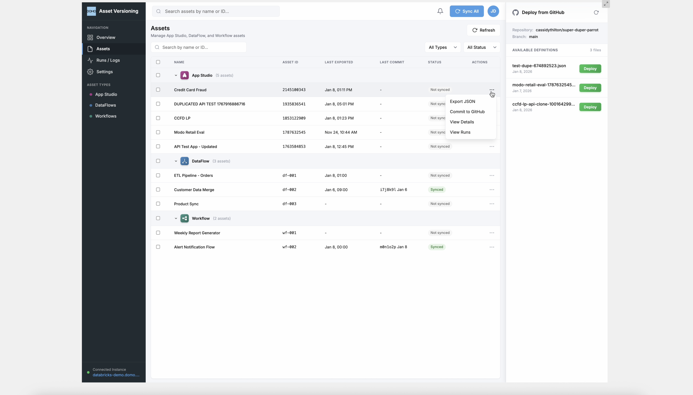
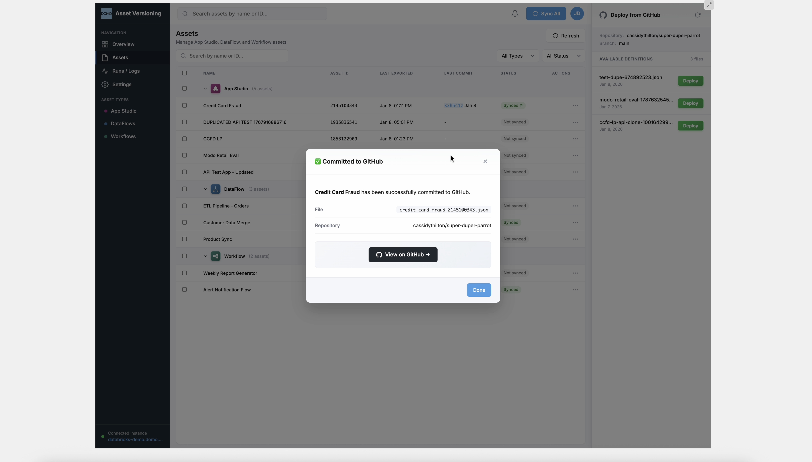
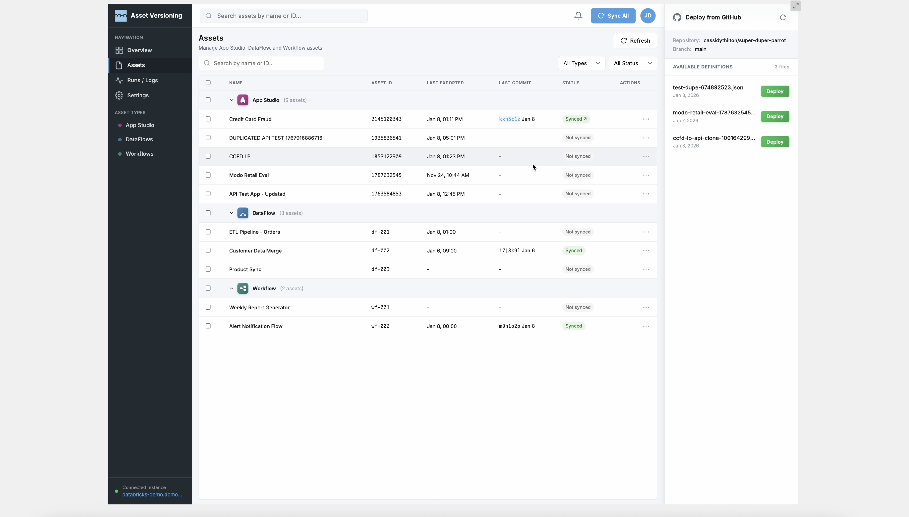
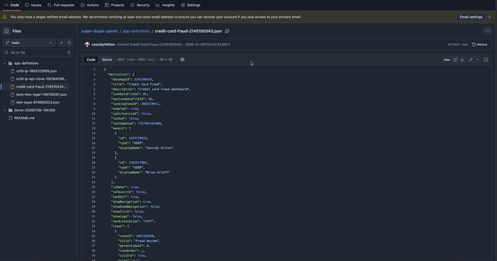
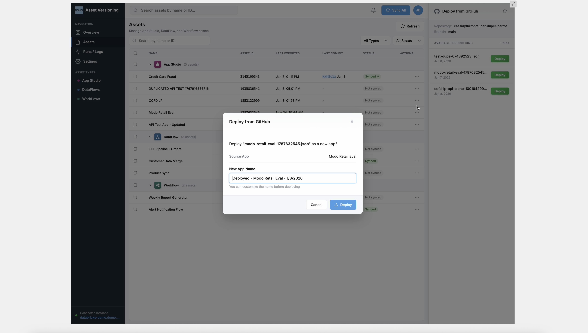
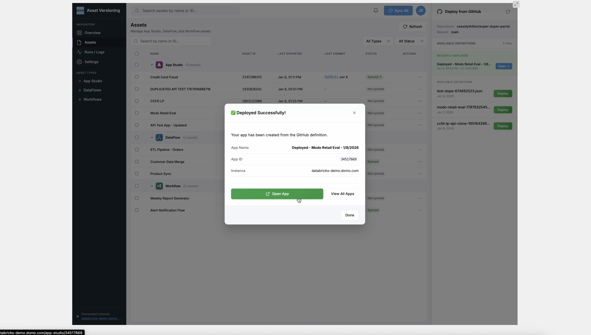
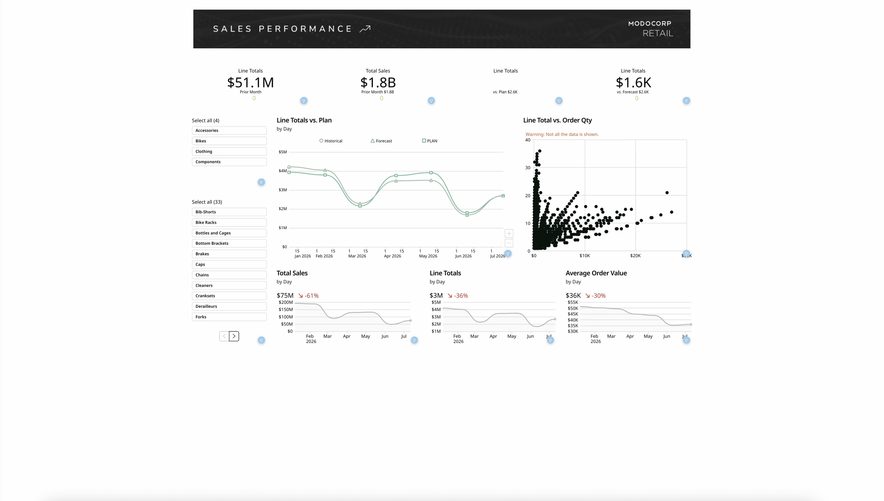
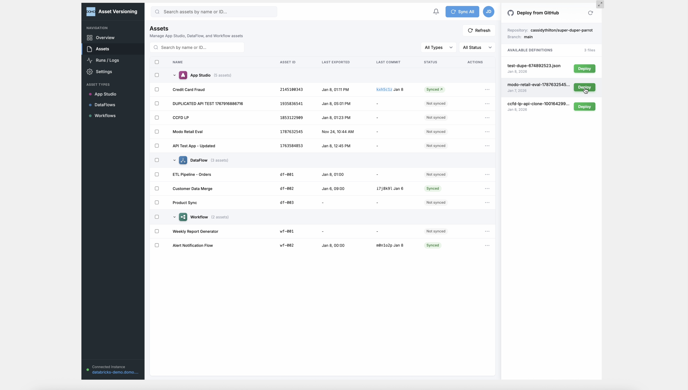

# Domo Asset Versioning — GitHub Integration

> **Git-backed version control for Domo App Studio.** Export live app definitions, commit them to GitHub, deploy from version history, and maintain a complete audit trail — all from inside a native Domo custom app.


<p align="center">
  
</p>

---

## The Problem

Domo App Studio has no built-in version control. There is no way to diff, rollback, or audit changes to an app's configuration over time. If an app breaks after an update, there is no "undo" — you rebuild from memory.

Teams managing dozens of App Studio apps across environments — dev, staging, production — have no reliable way to:

- **Track what changed** in an app's configuration between releases
- **Restore a previous state** without manual reconstruction
- **Promote definitions** across Domo instances with an auditable trail
- **Collaborate** on app development with Git-based workflows

This project closes that gap with a full Git-backed lifecycle — export, commit, deploy, audit — running natively inside Domo.

---

## The Workflow — End to End

### 1. Browse & Manage Assets

The **Assets** page presents every App Studio, DataFlow, and Workflow asset in a grouped, sortable table. Each row shows the asset name, ID, last export timestamp, last commit hash, and current sync status. The context menu (⋯) on any row provides direct actions: **Export JSON**, **Commit to GitHub**, **View Details**, and **View Runs**.

<p align="center">
  
</p>

### 2. Commit to GitHub

Selecting **Commit to GitHub** triggers a full pipeline: the app fetches the live definition from Domo's internal API, serializes it as JSON, generates a slug filename (e.g., `credit-card-fraud-2145100343.json`), and pushes it to the configured GitHub repository via the Contents API. A confirmation modal displays the committed filename, target repository, and a direct link to view the file on GitHub.

<p align="center">
  
</p>

Back in the Assets table, the **Status** column immediately reflects the change — "Synced ✓" with the abbreviated commit hash and date. Assets that haven't been committed yet show "Not synced," giving you an at-a-glance view of which apps are version-controlled and which are not.

<p align="center">
  
</p>

### 3. Verify on GitHub

Every committed definition lands in the repository as a fully portable JSON file. The raw definition includes the complete app structure — views, navigation, theme configuration, user access controls, and embedded workflow definitions. This is the same payload Domo uses internally to render the app, now versioned in Git with full diff and history support.

<p align="center">
  
</p>

### 4. Deploy from GitHub

The persistent **Deploy from GitHub** sidebar panel lists every JSON definition file in the repository. Clicking **Deploy** opens a dialog where you can name the new app instance before creation. Under the hood, the app reads the full JSON from GitHub, then calls Domo's app duplication API to instantiate a new, fully configured app from that definition.

<p align="center">
  
</p>

### 5. Deployed & Running

After deployment, a success modal confirms the new app with its name, assigned App ID, and target Domo instance. The **Open App** button links directly to the live App Studio instance. The sidebar also tracks recently deployed apps for quick access.

<p align="center">
  
</p>

### 6. The Result — A Live App from Git

The deployed app runs identically to the original. Below is a production dashboard restored from a GitHub-committed definition — complete with filters, charts, KPIs, and the original theme. No manual reconstruction. No configuration drift. Git is the source of truth.

<p align="center">
  
</p>

---

## Overview Dashboard

The **Overview** page provides at-a-glance operational visibility: total assets under management, the number synced to GitHub, deployments and failures over the last 7 days, and a real-time activity feed showing every export, commit, and deploy operation with timestamps, status, and duration.

<p align="center">
  
</p>

| Metric | Description |
|--------|-------------|
| **Total Assets** | Count of all tracked App Studio, DataFlow, and Workflow assets |
| **Synced to GitHub** | Assets with at least one successful commit |
| **Deployments (7d)** | Deploy actions executed in the last week |
| **Failures (7d)** | Failed operations in the last week |

---

## Architecture

```
┌─────────────────────────────────────────────────────────────┐
│                    Domo Custom App (iframe)                  │
│  ┌──────────┐  ┌──────────┐  ┌──────────┐  ┌─────────────┐ │
│  │ Overview  │  │  Assets  │  │ Runs/Logs│  │  Settings   │ │
│  │ Dashboard │  │  Table   │  │  Table   │  │  (GitHub)   │ │
│  └─────┬─────┘  └─────┬────┘  └─────┬────┘  └──────┬──────┘ │
│        └───────────────┼───────────────┘             │        │
│                        ▼                             │        │
│              ┌─────────────────┐                     │        │
│              │  app.js (Client)│◄────────────────────┘        │
│              └────────┬────────┘                              │
│                       │ domo.post()                           │
└───────────────────────┼───────────────────────────────────────┘
                        ▼
          ┌──────────────────────────────────┐
          │   Domo Code Engine (Server)      │
          │   codeengine/functions.js        │
          │                                  │
          │  ┌────────────────────────────┐  │
          │  │ listApps()                 │──┼──► Domo API
          │  │ getAppDefinition()         │──┼──► Domo API
          │  │ updateAppDefinition()      │──┼──► Domo API
          │  │ duplicateApp()             │──┼──► Domo API
          │  │ pushToGithub()             │──┼──► GitHub API
          │  │ listGithubFiles()          │──┼──► GitHub API
          │  │ getGithubFileContent()     │──┼──► GitHub API
          │  └────────────────────────────┘  │
          └──────────────────────────────────┘
```

**Why Code Engine?** Domo apps run in sandboxed iframes — direct calls to `api.github.com` or Domo's internal APIs are blocked by CORS. Code Engine functions execute server-side on Domo's infrastructure, bypassing these restrictions entirely. Domo API calls use `codeengine.getDomoClient()` for session-authenticated access; GitHub API calls use the Node.js `https` module with the user's PAT.

---

## Key Features

### Multi-Asset Type Management

The Assets page displays **three asset categories** in a grouped table:

| Type | Source | Status |
|------|--------|--------|
| **App Studio** | Live from Domo API | Fully functional — export, commit, deploy |
| **DataFlow** | Demo data | UI extensibility demonstration |
| **Workflow** | Demo data | UI extensibility demonstration |

App Studio apps are fetched live from Domo's `/api/content/v1/dataapps` endpoint. DataFlow and Workflow entries use sample data to demonstrate the UI's extensibility to additional asset types — the architecture supports any Domo asset that can be serialized as JSON.

### GitHub Commit Workflow

For any App Studio app, the context menu (⋯) provides:

- **Export JSON** — Fetch the full definition and download it locally
- **Commit to GitHub** — Export and push to the configured repository with an auto-generated commit message
- **View Details** — Inspect live metadata (views, user access, theme configuration)
- **View Runs** — Filter the audit log to a specific asset

The commit flow: fetch definition → generate slug filename → push via GitHub Contents API → display commit hash and link → update sync badge.

### Deploy from GitHub

The persistent right sidebar shows:

- **Repository & Branch** — Current GitHub configuration
- **Recently Deployed** — Apps created from GitHub definitions, with direct links to open in App Studio
- **Available Definitions** — JSON files from the repo, each with a one-click **Deploy** button

Deploy reads the full definition from GitHub and calls Domo's app duplication API to create a new, fully configured instance.

<p align="center">
  
</p>

### Audit Trail

Every operation — export, commit, deploy — is logged with:

- Run ID, timestamp, asset name, asset type
- Action type and status (Success / Failed)
- Duration in seconds

---

## Multi-Strategy GitHub File Resolution

A key engineering challenge: Domo Code Engine endpoint registration can be unpredictable for newly added functions. The app implements a **5-strategy fallback cascade** to guarantee the GitHub panel always renders content:

```
Strategy 1: Code Engine listGithubFiles()     → Direct function call
    ↓ (if 0 files or error)
Strategy 2: pushToGithub(__action: 'list')     → Reuses registered endpoint
    ↓ (if 0 files or error)
Strategy 3: Domo Proxy GET                     → /domo/github/repos/... proxy
    ↓ (if 0 files or error)
Strategy 4: Committed Files Cache              → In-session local cache
    ↓ (if empty)
Strategy 5: Hardcoded Fallback                 → Sample data (always succeeds)
```

The same cascade applies to file content retrieval. Each strategy only returns if it produces actual data — otherwise execution falls through to the next. This guarantees the deploy panel is never empty, regardless of Code Engine's runtime state.

---

## Code Engine API Reference

| Function | HTTP | Endpoint | Purpose |
|----------|------|----------|---------|
| `listApps()` | GET | `/api/content/v1/dataapps` | List all App Studio apps |
| `getAppDefinition(appId)` | GET | `/api/content/v1/dataapps/{id}` | Full app definition (views, theme, users) |
| `updateAppDefinition(appId, def)` | PUT | `/api/content/v1/dataapps/{id}` | Update an existing app |
| `duplicateApp(appId, title)` | POST | `/api/content/v1/dataapps/{id}/copy` | Clone an app from a stored definition |
| `pushToGithub(token, repo, branch, path, content, msg)` | PUT | GitHub Contents API | Create or update a file in the repo |
| `listGithubFiles(token, repo, branch, path)` | GET | GitHub Contents API | List JSON files in a directory |
| `getGithubFileContent(token, repo, branch, path)` | GET | GitHub Contents API | Fetch and decode file content |

`pushToGithub` also supports **multi-action routing** via `content.__action`:

- `'list'` → Returns directory listing (acts as `listGithubFiles`)
- `'getContent'` → Returns file content (acts as `getGithubFileContent`)
- *(omitted)* → Normal commit behavior

This pattern works around Code Engine's endpoint registration behavior, where pre-existing functions are more reliably available than newly added ones.

---

## Project Structure

```
├── app.js                    # Client-side application logic (~1,800 lines)
├── app.css                   # Complete UI stylesheet (~2,200 lines)
├── index.html                # App shell — sidebar, main content, GitHub panel
├── manifest.json             # Domo app manifest (defines Code Engine endpoints)
├── codeengine/
│   ├── functions.js          # Server-side Code Engine functions (7 exported)
│   ├── appstudio.js          # Legacy Domo client handlers
│   └── package.json          # Code Engine dependencies
├── app-definitions/          # Committed app definition JSON files (via app)
├── asset-definitions/        # Additional exported definitions (via app)
├── app-endpoint-examples/    # Example API payloads and responses
├── api-test/                 # Standalone API integration test scripts
├── screenshots/              # Documentation screenshots
├── appstudio.svg             # Asset type icon (App Studio)
├── dataflow.svg              # Asset type icon (DataFlow)
├── workflows.svg             # Asset type icon (Workflow)
├── domo.svg                  # Domo logo
└── thumbnail.png             # App thumbnail for Domo marketplace
```

---

## Setup & Deployment

### Prerequisites

- A Domo instance with **App Studio** access
- A **GitHub Personal Access Token** (fine-grained) with `Contents: Read and Write` permission on the target repository
- The [Domo CLI](https://developer.domo.com/portal/1845fc11bbe5d-command-line-interface-cli)

### Deploy to Domo

```bash
# Authenticate with your Domo instance
domo login

# Publish the app
domo publish
```

### Configure GitHub Integration

1. Open the app in Domo
2. Navigate to **Settings**
3. Enter your GitHub repository in `owner/repo` format
4. Set the target branch (default: `main`)
5. Paste your GitHub Personal Access Token
6. Click **Save Settings**

### Generate a GitHub PAT

1. Go to [GitHub → Settings → Developer Settings → Fine-grained tokens](https://github.com/settings/personal-access-tokens/new)
2. Scope the token to the target repository
3. Under **Repository permissions**, set **Contents** to **Read and Write**
4. Generate and copy the token

> **Security note:** The PAT is stored in browser memory for the session and passed to Code Engine functions at call time. It is never persisted to disk or committed to the repository.

---

## Tech Stack

| Layer | Technology |
|-------|-----------|
| **Frontend** | Vanilla JavaScript, CSS3 — no frameworks (runs in Domo's sandboxed iframe) |
| **Backend** | Domo Code Engine (Node.js runtime) |
| **Domo APIs** | `/api/content/v1/dataapps` (internal, session-authenticated) |
| **GitHub APIs** | REST API v3 — Contents, Repositories |
| **Auth** | Domo session (automatic via `domo.js` SDK), GitHub PAT (user-provided) |
| **Transport** | `domo.js` SDK for proxy routing and Code Engine invocation |

---

## Design Decisions

| Decision | Rationale |
|----------|-----------|
| **Vanilla JS, no framework** | Domo's iframe sandbox limits bundle size and eliminates the need for SPA routing; vanilla JS keeps the app fast and dependency-free |
| **Code Engine for all API calls** | CORS restrictions in Domo's iframe prevent direct API calls; Code Engine runs server-side with full network access |
| **Multi-action routing on `pushToGithub`** | Code Engine sometimes fails to register new endpoints; routing multiple actions through one proven endpoint provides reliability |
| **5-strategy file resolution** | Guarantees the GitHub panel always has content, even when Code Engine endpoints are partially unavailable |
| **JSON definitions as source of truth** | App definitions are serializable JSON — storing them as files in Git provides natural diffing, branching, and history |

---

## Version History

| Version | Date | Highlights |
|---------|------|------------|
| **3.1.0** | Feb 2026 | Multi-strategy GitHub file resolution, Code Engine `__action` routing, null-safe response handling |
| **3.0.0** | Jan 2026 | Full UI redesign — responsive sidebar, div-based activity feed, compact tables, deploy from GitHub, commit modals, deployed app tracking |
| **2.x** | Dec 2025 | Initial GitHub integration, Code Engine functions, basic asset management |

---

## License

MIT

---

*Built for the Domo platform. Designed to bring Git-based version control to App Studio — because every app deserves a history.*
